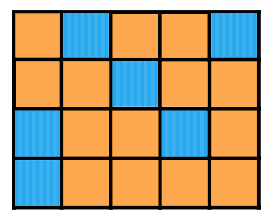

# 2D Pattern Matching using NumPy Arrays

In this example, a robot is navigating a 4x5 orange and blue world, shown below. This robot also has a sensor that tells it the color of the square it's on top of and the color of the square directly to its right.


In Python code, the world and the sensor measurement can be represented by the following code (where 'o' stands for orange and 'b' for blue):
```python
import numpy as np

world = np.array ([ ['o', 'b', 'o', 'o', 'b'],
                    ['o', 'o', 'b', 'o', 'o'],
                    ['b', 'o', 'o', 'b', 'o'],
                    ['b', 'o', 'o', 'o', 'o'] ])

measurement = ['b', 'o']
```
It's now easy for us to see that there are only a few places in the world that this robot can be, based on where the measurement lines up with color patterns on the world grid! In this exercise, it'll be up to you to find these locations programmatically.

